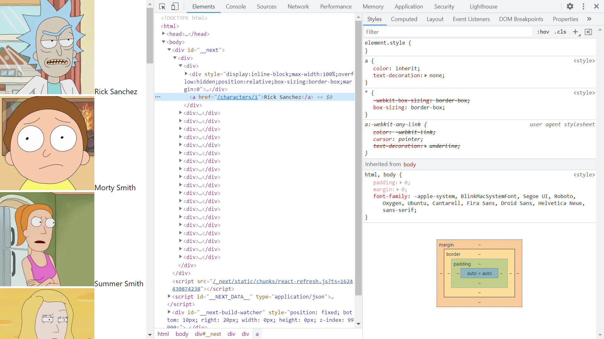

# :zap: Next Apollo GraphQL

* A Next.js React app using Apollo GraphQL to get data from an API.
* **Note:** to open web links in a new window use: _ctrl+click on link_


## :page_facing_up: Table of contents

* [:zap: Next Apollo GraphQL](#zap-next-apollo-graphql)
  * [:page\_facing\_up: Table of contents](#page_facing_up-table-of-contents)
  * [:books: General Info](#books-general-info)
  * [:camera: Screenshots](#camera-screenshots)
  * [:signal\_strength: Technologies](#signal_strength-technologies)
  * [:floppy\_disk: Setup](#floppy_disk-setup)
  * [:computer: Code Examples](#computer-code-examples)
  * [:clipboard: Status \& To-Do List](#clipboard-status--to-do-list)
  * [:clap: Inspiration](#clap-inspiration)
  * [:file\_folder: License](#file_folder-license)
  * [:envelope: Contact](#envelope-contact)

## :books: General Info

* Previously displayed data from the [Netlify fruits API](https://fruits-api.netlify.app/graphql) but this is no longer live. [The API](https://github.com/Franqsanz/fruits-api/blob/main/readme.md) is now down.
* Next.js is for server-rendered react apps. It has automatic code splitting, simple page-based routing, built-in CSS support and hot reloading. Every component file in the pages folder is treated as a page.
* Apollo Client used to fetch data using GraphQL.
* GraphQL only return the data requested. Data only served from a single end-point. Lots of companies use it. GraphQL makes tasks more complex and there are possible performance issues that would not occur using REST with a web cache.
* Tailwind CSS added to Next.js
* Picsum API random photo is displayed
* Latest Next/Image optimisation used so image downloaded as Webp format and automatically sized. This is a major advantage over non-optimised Images.
* Converted to Progressive Web App (PWA).
* Custom Document file ./pages/_document.js created to override and extend default Document. It injects meta tags into every page

## :camera: Screenshots

.

## :signal_strength: Technologies

* [Node.js v18](https://nodejs.org/) javascript runtime using the [Chrome V8 engine](https://v8.dev/).
* [React v18](https://reactjs.org/) Javascript library.
* [GraphQL v16](https://github.com/graphql/graphql-js)
* [Apollo v3](https://www.apollographql.com/) GraphQL implementation data graph layer
* [Next v13](https://nextjs.org/) minimalist framework for rendering react apps on the server. Only v12.2.2 works, higher version causes errors.
* [Next with Apollo v5](https://www.npmjs.com/package/next-with-apollo) to save coding time
* [Apollo Client v3](https://www.npmjs.com/package/apollo-client) caching GraphQL client to UI components can fetch data via GraphQL. More documentation [here](https://apollographql.com/docs/react/).
* [Picsum API image](https://picsum.photos/images). No API key required, image size can be specified in url

## :floppy_disk: Setup

* `npm run codegen` to run codegen to generate output to `generated/index.tsx`
* `npm run dev` runs the app in the development mode. Open [http://localhost:3000](http://localhost:3000) to view it in the browser.
* `npm run build` builds the app for production to the `build` folder. It correctly bundles React in production mode and optimizes the build for the best performance. The build is minified and the filenames include the hashes.

## :computer: Code Examples

* `withApollo` function to return instance of Apollo client

```tsx
const withApollo = nextWithApollo(

  ({ initialState, headers }) => {
    return new ApolloClient({
      ssrMode: typeof window === "undefined",
      link: new HttpLink({
        uri: "https://rickandmortyapi.com/graphql",
      }),
      headers: {
        ...(headers as Record<string, string>),
      },
      cache: new InMemoryCache().restore(initialState || {}),
    });
  },
  {
    // eslint-disable-next-line react/display-name
    render: ({ Page, props }) => {
      // eslint-disable-next-line react-hooks/rules-of-hooks
      const router = useRouter();
      return (
        <ApolloProvider client={props.apollo}>
          <Page {...props} {...router} />
        </ApolloProvider>
      );
    },
  }
);
```

## :clipboard: Status & To-Do List

* Status: Working
* To-Do: Update sitemap, robots files. Add styles

## :clap: Inspiration

* [TomDoesTech: Apollo Client (3) in Next.js (10) with TypeScript & GraphQL Code Generator](https://www.youtube.com/watch?v=4yDrtFUbUzo&t=415s)
* [How to Loop in React JSX](https://stackabuse.com/how-to-loop-in-react-jsx/)

## :file_folder: License

* N/A

## :envelope: Contact

* Repo created by [ABateman](https://github.com/AndrewJBateman), email: gomezbateman@yahoo.com
